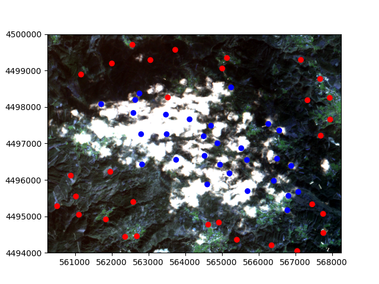
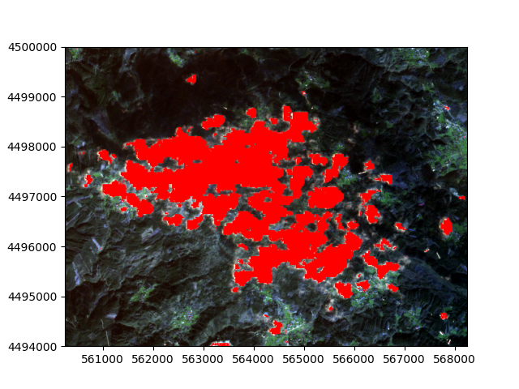

SpartANN
========

**Spectral Pattern Analysis and Remote-sensing Tool with Artificial Neural Networks**

SpartANN uses fully connected Artificial Neural Networks with backpropagation learning to perform supervised image classification. It provides a simple interface for building and predicting models with common text formats for labeled point location data and raster images.

Additionally, it offers an easy way to produce multiple models under an ensembling framework, enabling predictions with associated uncertainty. SpartANN is a flexible platform, supporting both command-line tools for straightforward usage and Python sessions for advanced configurations via a simple API.

Installation
------------

The easiest way to install SpartANN is through a conda environment using the `environment.yml` file provided. Refer to the `SpartANN documentation <https://ptarroso.github.io/SpartANN/>`_ for more details.

Examples
--------

The `documentation <https://ptarroso.github.io/SpartANN/>`_ provides step-by-step examples based on the data included in the package. The primary example uses a subset of a Sentinel-2 image alongside data identifying pixel clouds.

    Original image (True Color) with classification points

    Predicted clouds with SpartANN
